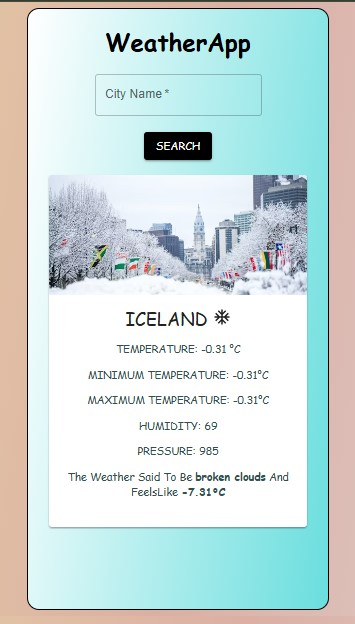

# 🌦️ Simple Weather App

A simple and responsive **Weather App** built using **React JS** and **Tailwind CSS**.
This app fetches real-time weather data from a public API and displays the **temperature**, **humidity**, and **weather conditions** of any city entered by the user.

## 🚀 Features

* Real-time weather data using API
* Search by city name
* Clean and minimal UI built with Tailwind CSS
* Fully responsive design for mobile and desktop
* Fast and easy to use

## 🛠️ Tech Stack

* **React JS**
* **Tailwind CSS**
* **OpenWeatherMap API** (or any public weather API)
## 📸 Screenshots



## 🎥 Preview Video

> [🎬 Watch Demo Video](./src/assets/WeatherApp_Preview.mp4)

## ⚙️ Installation

1. Clone the repository

   ```bash
   git clone https://github.com/yourusername/weather-app.git
   ```
2. Navigate to the project folder

   ```bash
   cd weather-app
   ```
3. Install dependencies

   ```bash
   npm install
   ```
4. Run the app

   ```bash
   npm run dev
   ```

## 🧠 Learning Purpose

This project is perfect for beginners who want to learn how to:

* Use **React hooks** for state management
* Work with **APIs** in React
* Style with **Tailwind CSS**
* Build and deploy simple front-end applications

